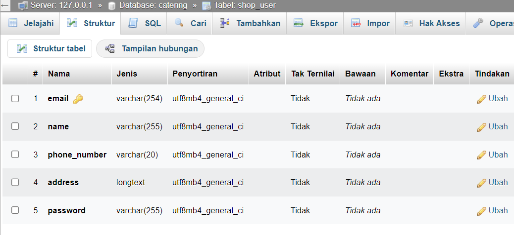
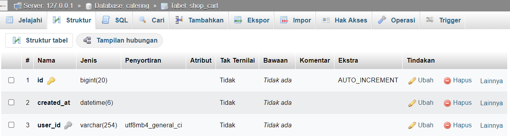
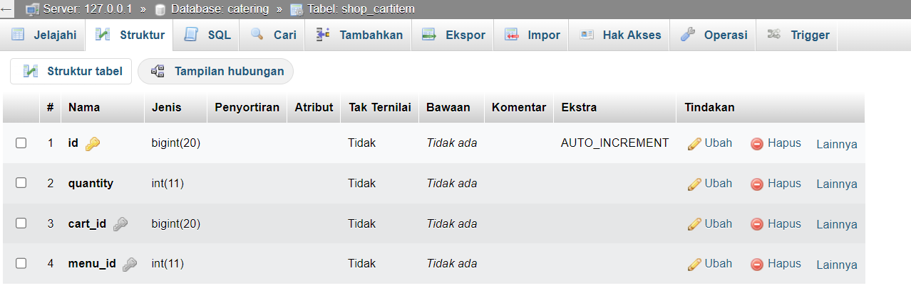
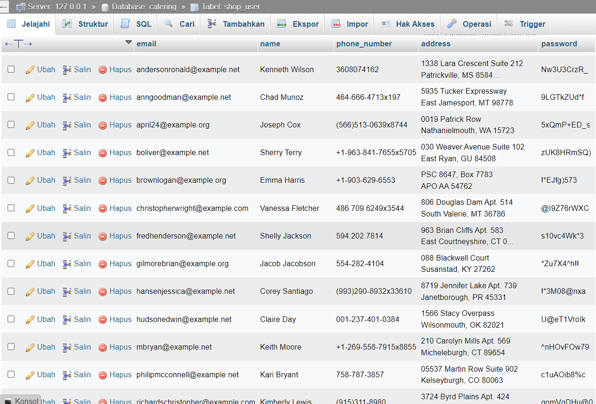
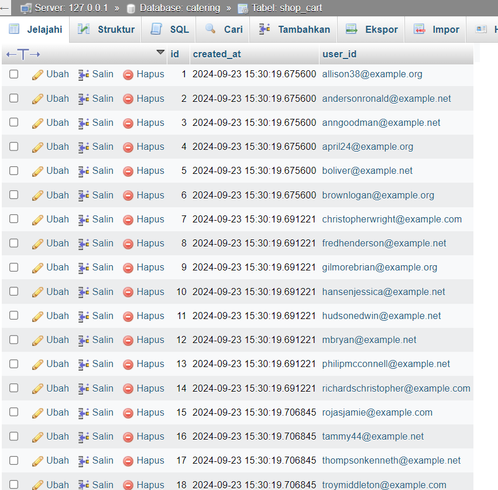
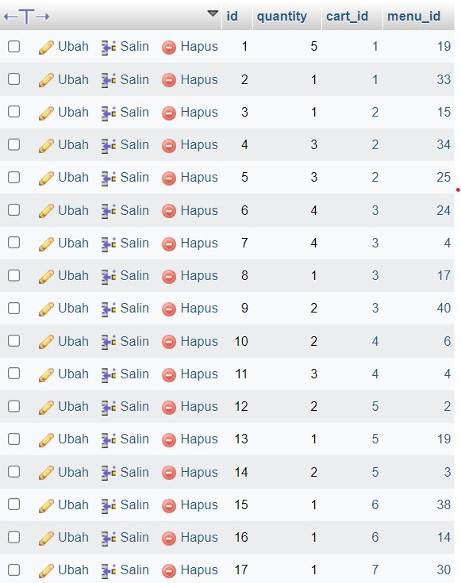

2109106056
AHMAD DHIYA ULHAQI

# POSTTEST 1 

tipis tipis tes django

# POSTTEST 2
### Database Catering

### Struktur Model/Tabel

### Data seed

# POSTTEST 3
### Django Admin

### Static
penggunaan file image pada path static untuk icon .

### action/custom function
Penambahan fungsi save_model() pada model order, yang mana ketika model order ditambahkan maka akan menghapus item yang ada pada keranjang user.